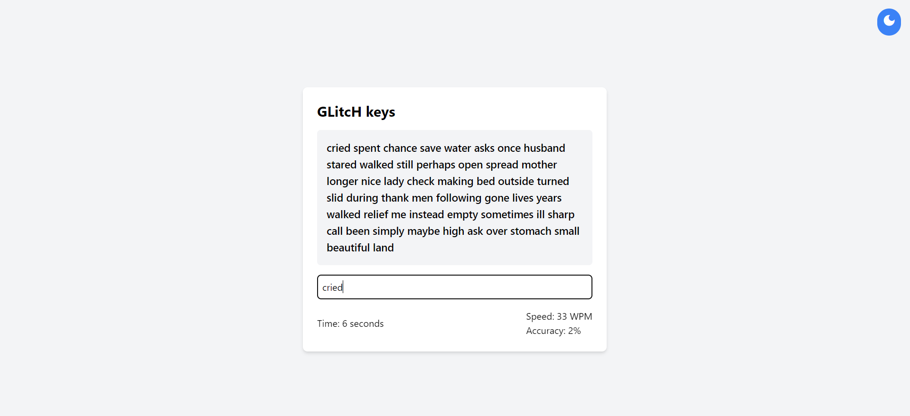
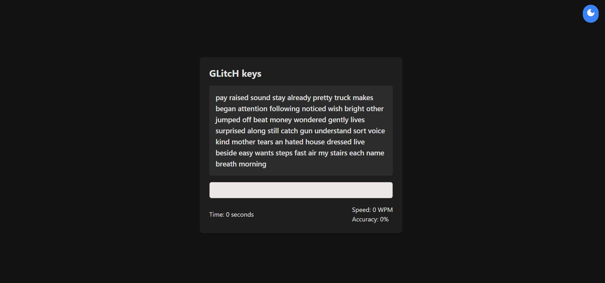
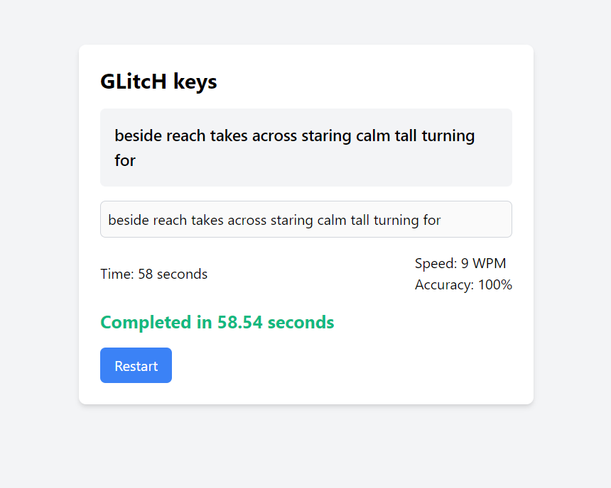
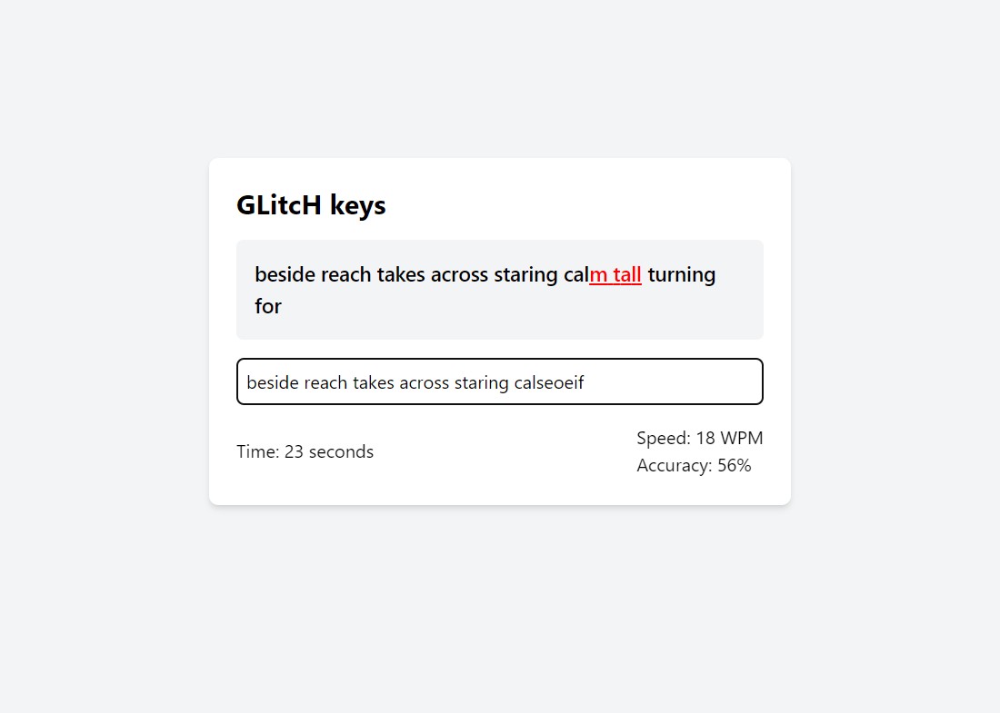

# Typing Practice Web Application

## Overview

This project is a Typing Practice web application designed to help users improve their typing speed and accuracy. The application offers a clean, material design interface and supports both light and dark modes. The application dynamically generates sentences for the user to type, measures typing speed and accuracy in real-time, and displays the completion time once the user finishes typing.  Visit now [GLitcH keys](https://arkadipta-kundu.github.io/GLitcH-keys/).



## Features

- **Dynamic Sentence Generation**: Sentences are generated randomly from a predefined set of words.
- **Real-Time Typing Metrics**: Real-time calculation and display of typing speed (words per minute) and accuracy.
- **Dark Mode Support**: Toggle between light and dark modes to suit user preference.
- **Completion Time Display**: Shows the time taken to complete typing the sentence.
- **Error Highlighting**: Highlights typing errors by marking incorrect characters in red.
- **Responsive Design**: Utilizes Tailwind CSS for a responsive and elegant design.
- **Timer Initialization on Typing**: The timer starts only when the user begins typing, not when the test is initiated.

## Technologies Used

- **HTML**: Structure of the web application.
- **CSS (Tailwind CSS)**: Styling the application with a material design theme and responsive layout.
- **JavaScript**: Functionality for real-time typing metrics, dark mode toggle, and dynamic content updates.

## Installation

1. **Clone the Repository**
    ```sh
    git clone <[repository-url](https://github.com/Arkadipta-Kundu/GLitcH-keys)>
    ```
2. **Navigate to the Project Directory**
    ```sh
    cd GLitcH-keys
    ```

## Usage

1. **Open `index.html`**: Open the `index.html` file in your web browser or Visit now [GLitcH keys](https://arkadipta-kundu.github.io/GLitcH-keys/).

## Features in Detail

### Dynamic Sentence Generation

The application generates random sentences from a predefined set of words. You can customize the set of words and the length of the sentences generated.

```javascript
const words = ["likely", "understood"];
function generateSentence(length) {
    let result = [];
    for (let i = 0; i < length; i++) {
        result.push(words[Math.floor(Math.random() * words.length)]);
    }
    return result.join(' ');
}
```

### Real-Time Typing Metrics

The application calculates and displays typing speed (words per minute) and accuracy in real-time.

```javascript
function checkInput() {
    // Code to calculate speed and accuracy
}
```

### Dark Mode Support

Toggle between light and dark modes using the button provided. The user preference is saved in `localStorage`.

```javascript
function toggleDarkMode() {
    document.body.classList.toggle('dark');
    localStorage.setItem('darkMode', document.body.classList.contains('dark'));
}
```



### Completion Time Display

The application displays the time taken to complete the typing test in minutes and seconds format if it exceeds 60 seconds.

```javascript
function updateTimer() {
    const timeTaken = Math.floor((new Date().getTime() - startTime) / 1000);
    document.getElementById('timer').textContent = formatTime(timeTaken);
}

function formatTime(seconds) {
    const minutes = Math.floor(seconds / 60);
    const remainingSeconds = seconds % 60;
    return minutes > 0 ? `${minutes}:${remainingSeconds.toString().padStart(2, '0')}` : remainingSeconds.toString();
}
```



### Error Highlighting

Incorrect characters are highlighted in red to help users identify their mistakes.

```javascript
const sentenceChars = document.getElementById('sentence').querySelectorAll('span');
for (let i = 0; i < sentence.length; i++) {
    if (input[i] === undefined) {
        sentenceChars[i].classList.remove('mistake');
    } else if (input[i] !== sentence[i]) {
        sentenceChars[i].classList.add('mistake');
    } else {
        sentenceChars[i].classList.remove('mistake');
    }
}
```


## Contributing

1. **Fork the repository**
2. **Create a new branch**
    ```sh
    git checkout -b feature-branch
    ```
3. **Make your changes**
4. **Commit your changes**
    ```sh
    git commit -m "Add new feature"
    ```
5. **Push to the branch**
    ```sh
    git push origin feature-branch
    ```
6. **Create a pull request**

## License

This project is licensed under the MIT License.

## Contact

For any questions or feedback, please contact Arkadipra Kundu at arkadiptak49@gmail.com.

---

Thank you for using the Typing Practice Web Application! We hope it helps you improve your typing skills. Happy typing!
